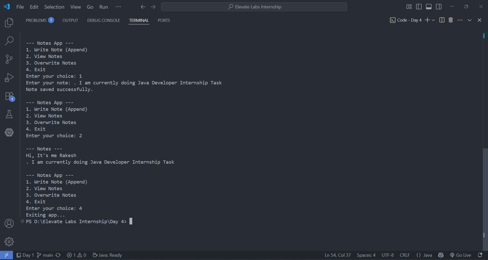

# Notes App - Java File I/O

Task 4 submission for Elevate Labs Java Developer Internship.

## 📄 Description
A simple Java console-based notes manager that supports:
- Writing notes to a file (append or overwrite)
- Reading notes from the file

## 🛠 Tools Used
- Java (JDK)
- VS Code 
- Terminal

## 🧠 Concepts Used
- File I/O using FileWriter, FileReader, BufferedReader
- Exception Handling (try-catch, try-with-resources)
- Scanner for user input

## 🚀 How to Run
1. Compile:
   javac NotesApp.java
2. Run:
   java NotesApp

## 📁 Files Included
- NotesApp.java
- notes.txt (created after writing notes)
- README.md
- Interview_Questions.txt

## 📝 Outcome
Learn to persist text data in files using Java I/O streams.
